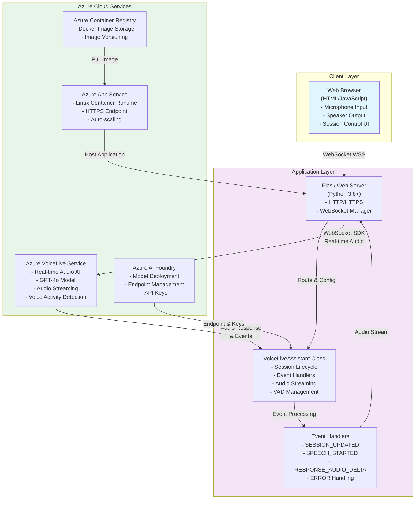
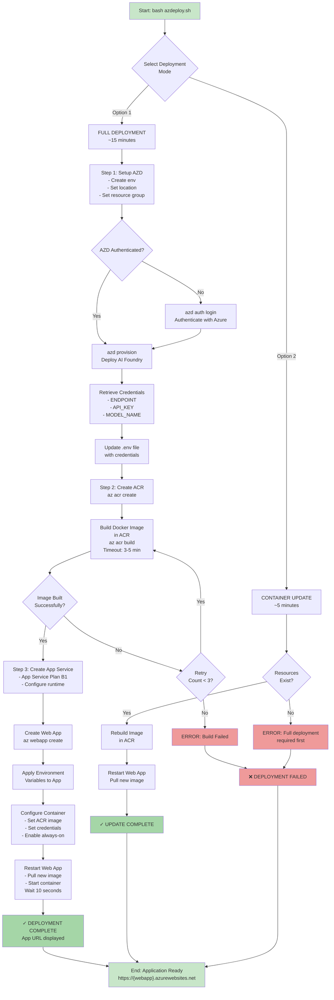
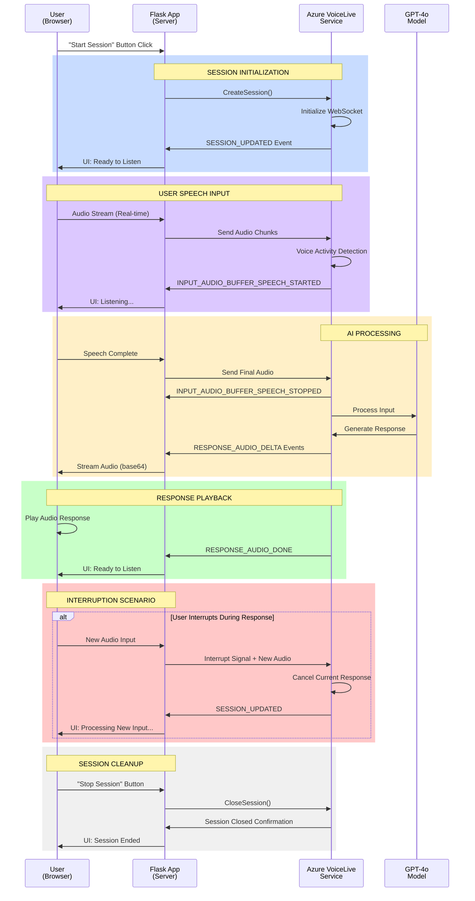

# Product Requirements Document (PRD): Azure AI Voice Live Agent Web Application

## 1.1 Document Information

**Version:** 1.0

**Author(s):** GitHub Copilot

**Date:** January 16, 2026

**Status:** Active

**Related Lab:** Develop an Azure AI Voice Live voice agent

## 1.2 Executive Summary

This document defines the requirements for a Flask-based Python web application that enables real-time, bidirectional voice interactions with an Azure AI Voice Live agent. The application demonstrates best practices for integrating Azure's real-time voice AI capabilities with web technologies, providing a foundation for building conversational AI experiences. The solution leverages WebSocket connections, asynchronous event handling, and containerized deployment on Azure App Service.

## 1.3 Problem Statement

Organizations need a scalable, production-ready template for building voice-enabled conversational AI applications that can:

- Handle real-time audio streaming with low latency

- Support natural conversational interruption patterns

- Manage complex session lifecycle and event handling

- Deploy seamlessly to cloud infrastructure

- Support cross-platform SDK implementations

## 1.4 Goals and Objectives

- Provide a complete, working Flask application for real-time voice interactions with Azure AI Voice Live

- Demonstrate proper implementation of WebSocket connection management and session handling

- Enable natural conversation flow with interruption support

- Automate deployment to Azure Container Registry and App Service

- Create a reusable template for multi-language SDK implementations

## 1.5 Scope

### 1.5.1 In Scope

- Flask-based Python web application with real-time voice capabilities

- Azure VoiceLive SDK integration and session configuration

- WebSocket event handling for bidirectional communication

- Voice Activity Detection (VAD) configuration and management

- Session lifecycle management (initialization, interruption, shutdown)

- Audio streaming with base64 encoding for client delivery

- Containerized deployment using Azure Container Registry

- App Service deployment and configuration

- Azure Cloud Shell-based setup and deployment automation

- Bash scripting for deployment orchestration

- Error handling and logging mechanisms

### 1.5.2 Out of Scope

- Multi-language implementations (reference only; documentation for .NET SDK provided)

- Advanced audio processing and filtering

- Custom machine learning model training

- Integration with third-party voice providers beyond Azure

- Mobile application development

- Speech recognition only (ASR) implementations

## 1.6 User Stories / Use Cases

| User Story | Description |

| ---------- | ------------------------------------------------------------------------------------------------------------------------------ |

| US-1 | As a developer, I want to download pre-built base files and implement voice assistant functionality to accelerate development. |

| US-2 | As a developer, I want to implement proper session initialization and configuration to ensure reliable voice interactions. |

| US-3 | As a developer, I want to handle user interruptions gracefully so conversations feel natural and responsive. |

| US-4 | As a developer, I want to stream assistant audio responses to web clients for real-time playback. |

| US-5 | As a developer, I want to deploy the application automatically to Azure with a single command. |

| US-6 | As an end user, I want to start a voice session and interact naturally with the assistant. |

| US-7 | As an end user, I want to interrupt the assistant and have my input processed immediately. |

| US-8 | As an operations engineer, I want to monitor application health and manage resources efficiently. |

## 1.7 Functional Requirements

| Requirement ID | Description | Priority |

| -------------- | --------------------------------------------------------------------------------------------------------------------------- | -------- |

| FR-1 | The application shall download and unzip base project files from the Microsoft Learning repository. | HIGH |

| FR-2 | The application shall initialize the VoiceLive assistant with endpoint, credentials, model, voice, and system instructions. | HIGH |

| FR-3 | The application shall establish an asynchronous WebSocket connection to Azure VoiceLive service. | HIGH |

| FR-4 | The application shall configure session with dual modalities (audio and text) for bi-directional communication. | HIGH |

| FR-5 | The application shall implement Server-side Voice Activity Detection (VAD) with configurable sensitivity thresholds. | HIGH |

| FR-6 | The application shall set input and output audio formats to PCM16 for compatibility. | HIGH |

| FR-7 | The application shall handle SESSION_UPDATED events to signal readiness for user input. | HIGH |

| FR-8 | The application shall handle INPUT_AUDIO_BUFFER_SPEECH_STARTED events to detect user speech initiation. | HIGH |

| FR-9 | The application shall implement interruption logic when user speaks during assistant response. | HIGH |

| FR-10 | The application shall handle INPUT_AUDIO_BUFFER_SPEECH_STOPPED events and transition to processing state. | HIGH |

| FR-11 | The application shall handle RESPONSE_AUDIO_DELTA events and stream audio to connected WebSocket clients. | HIGH |

| FR-12 | The application shall encode audio data as base64 for client-side WebSocket delivery. | HIGH |

| FR-13 | The application shall handle RESPONSE_AUDIO_DONE events and reset to ready state. | HIGH |

| FR-14 | The application shall handle ERROR events and communicate error messages to users. | HIGH |

| FR-15 | The application shall support graceful shutdown with \_stopping flag. | MEDIUM |

| FR-16 | The deployment script shall deploy the AI model to Azure AI Services. | HIGH |

| FR-17 | The deployment script shall build container image using Azure Container Registry tasks. | HIGH |

| FR-18 | The deployment script shall deploy the application to Azure App Service. | HIGH |

| FR-19 | The application shall support manual session start/stop control from the web UI. | HIGH |

| FR-20 | The application shall require audio device access (microphone and speaker) from the client. | HIGH |

## 1.8 Non-Functional Requirements

| Category | Requirement |

| ------------------ | ----------------------------------------------------------------------------------------- |

| **Performance** | Audio latency must be < 500ms for natural conversation flow |

| **Scalability** | Application must support multiple concurrent WebSocket connections |

| **Reliability** | Application must automatically reconnect on temporary network failures |

| **Availability** | Application must maintain 99.9% uptime on Azure App Service |

| **Security** | All audio data must be transmitted over HTTPS/WSS connections |

| **Security** | Authentication credentials must be stored in Azure Key Vault or App Service configuration |

| **Usability** | UI controls must clearly indicate session state (idle, listening, processing, speaking) |

| **Supportability** | Application must log all events and errors for troubleshooting |

| **Portability** | Application must run on Linux-based Azure App Service instances |

| **Extensibility** | Code structure must allow easy integration of additional event handlers |

## 1.9 Assumptions and Dependencies

### Assumptions

- Users have access to Azure Cloud Shell and Azure portal

- Users have appropriate Azure subscription and permissions to create resources

- Audio I/O devices are available on client machines

- Bash shell environment is available and properly configured

- Modern web browser with WebSocket support is available

- Network bandwidth is sufficient for real-time audio streaming

### Dependencies

**Azure Services:** Azure AI Services (VoiceLive), Azure Container Registry, Azure App Service

**Programming Languages:** Python 3.8+, Bash, HTML/JavaScript for client

**Libraries:** Flask, azure-ai-voicelive SDK, asyncio, base64

**Base Files:** Pre-built Flask application template from Microsoft Learning repository

**Deployment Tools:** Azure CLI (az), Azure Dev CLI (azd), Docker

**Models:** GPT-4o or compatible model for assistant behavior

## 1.10 Success Criteria / KPIs

[x] All code implementation sections are completed and properly indented

[x] Deployment script executes successfully on Azure Cloud Shell

[x] Application deploys to Azure App Service without environment variable errors

[x] Web UI loads and displays session state transitions

[x] User can initiate voice session and speak to the assistant

[x] Assistant responds with natural speech within acceptable latency

[x] User can interrupt assistant and have input processed immediately

[x] Application handles errors gracefully with user-friendly messages

[x] Excessive audio chunk messages do not appear in logs under normal operation

[x] Application can be redeployed with option 2 without full redeployment

[ ] User satisfaction score (if applicable)

## 1.11 Technical Architecture

### System Architecture Diagram



### Deployment Pipeline Flowchart



### Session Lifecycle & Event Flow



## 1.12 Milestones & Timeline

| Milestone | Estimated Duration | Status |

| ---------------------------------- | ------------------ | ------------- |

| Environment Setup | 5 minutes | Prerequisite |

| Download Base Files | 2 minutes | Prerequisite |

| Implement Assistant Initialization | 5 minutes | Active |

| Implement Session Configuration | 3 minutes | Active |

| Implement Event Handlers | 7 minutes | Active |

| Code Review and Testing | 5 minutes | Active |

| Deployment Configuration | 3 minutes | Active |

| Execute Deployment | 10 minutes | Active |

| Application Testing | 5 minutes | Active |

| **Total Duration** | **~30 minutes** | **Estimated** |

## 1.13 Usage Instructions (Demonstration Sequence)

### Prerequisites

- Access to Azure Cloud Shell in Azure portal (https://portal.azure.com)

- Bash environment configuration

- Audio I/O device on client machine

- Modern web browser with WebSocket support

### Step-by-Step Execution

## Launch Cloud Shell

- Navigate to Azure portal

- Click [>_] button to open Cloud Shell

- Switch to Bash environment if needed

- Access Classic version for code editor

## Download Base Files

```

bash
mkdir voice-live-web && cd voice-live-web
wget <https://github.com/MicrosoftLearning/mslearn-ai-language/raw/refs/heads/main/downloads/python/voice-live-web.zip>
unzip voice-live-web.zip
cd src

```

text
text

## Implement Assistant Code Sections

- Edit flask_app.py using `code flask_app.py`

- Locate "# BEGIN VOICE LIVE ASSISTANT IMPLEMENTATION" marker

- Implement `__init__` method with parameters and state initialization

- Implement `start` method with SDK imports

- Save with Ctrl+S

## Implement Session Configuration

- Locate "# BEGIN CONFIGURE VOICE LIVE SESSION" marker

- Configure RequestSession with audio/text modalities

- Set voice, audio formats, and VAD parameters

- Save with Ctrl+S

## Implement Event Handlers

- Locate "# BEGIN HANDLE SESSION EVENTS" marker

- Implement comprehensive event routing and handlers

- Include session_updated, speech_started, speech_stopped handlers

- Implement audio streaming and error handling

- Save and exit with Ctrl+Q

## Review Application Code

- Examine complete implementation

- Verify state management and WebSocket integration

- Confirm error handling coverage

## Configure Deployment

**Windows OS (PowerShell):**

- Navigate to root: `cd voice-live-web`

- Edit azdeploy.ps1 deployment script

- Update resource group name (rg parameter)

- Update Azure region (location parameter - recommend eastus2 or swedencentral)

- Save and exit

**WSL2/Linux (Bash - Alternative):**

- Navigate to root: `cd ~/voice-live-web`

- Edit azdeploy.sh deployment script

- Update parameters as above

- Note: Windows PowerShell approach is recommended to avoid authentication complexity

## Execute Deployment

**Windows OS (Recommended):**

- Open PowerShell terminal

- Run: `powershell -NoExit -Command ".\azdeploy.ps1"`

- Select option 1 when prompted for initial deployment

- Follow authentication prompts

- Verify model deployment completes successfully

- Container build will proceed automatically

**WSL2/Linux (Alternative):**

- Use Windows PowerShell approach above (preferred)

- If using bash in WSL2: `bash azdeploy.sh`

- Note: May encounter Bicep/authentication issues in WSL2; PowerShell on Windows is more reliable

## Test Application

- When deployment completes, copy provided app URL

- Navigate to application in web browser

- Click "Start session" button

- Grant microphone and speaker permissions

- Begin speaking when prompted

- Observe state transitions and responses

- Test interruption by speaking during assistant response

Troubleshooting Guide

| Issue | Resolution |

| ------------------------------------ | ---------------------------------------------------------------------------------------- |

| Missing environment variables | Restart application in App Service |

| Excessive audio chunk messages | Stop and restart session |

| Application fails to start | Verify all code implementations for correct indentation; Re-run deployment with option 2 |

| Deployment fails at model deployment | Change region in azdeploy.ps1 and retry; ensure you're using PowerShell on Windows |

| Deployment interrupted mid-execution | Re-run azdeploy.ps1 (Windows) or azdeploy.sh (WSL2); select option 2 for image-only update |

| WSL2: Bicep resolution errors | This is a known WSL2 limitation; use PowerShell on Windows with azdeploy.ps1 instead |

| Authentication prompts fail in WSL2 | Browser-open fails in headless WSL2; use Windows PowerShell with azdeploy.ps1 instead |

## 1.14 Key Takeaways

- Real-time voice AI requires careful session lifecycle management and event handling

- Natural conversation flow depends on proper interruption logic implementation

- Server-side Voice Activity Detection reduces client-side complexity

- Containerized deployment enables consistent, reproducible production environments

- Asynchronous event handling with WebSockets enables low-latency bidirectional communication

- Base64 audio encoding facilitates web client integration

## 1.15 Related Documentation

[Azure AI VoiceLive SDK Documentation](https://learn.microsoft.com/en-us/azure/ai-services/voice-live/)

[Flask WebSocket Integration](https://flask.palletsprojects.com/)

[Azure Container Registry Documentation](https://learn.microsoft.com/en-us/azure/container-registry/)

[Azure App Service Documentation](https://learn.microsoft.com/en-us/azure/app-service/)

[Azure VoiceLive .NET Client Library](https://www.nuget.org/packages/Azure.AI.VoiceLive/)

## 1.16 Questions and Feedback

Should multi-language SDK implementations be included in the template?

Are there specific voice profiles or localization requirements?

Should custom system prompts be configurable via UI?

Is integration with conversational analytics required?

Should application support message history persistence?

---

## Document Version History

| Version | Date | Author | Changes |

|---|---|---|---|

| 1.0 | 2026-01-16 | GitHub Copilot | Initial PRD created from lab exercise |

\n
