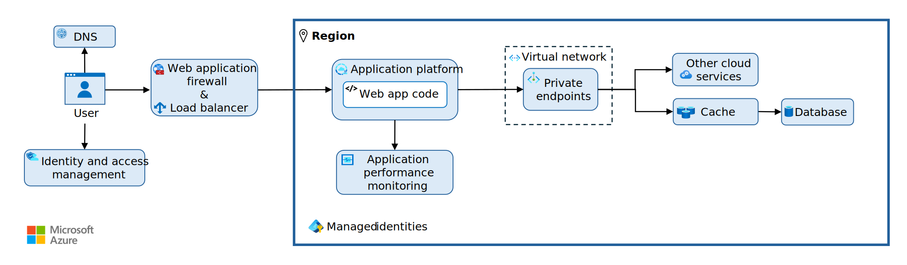

# Azure Reliable Web App

This project is a Spring Boot application that implements the Azure reliable web app pattern, focused on resilience, scalability, and security for deploying enterprise-grade web applications on Azure.



## Architecture Overview

This application follows the reliable web app architecture pattern on Azure, which includes:

1. **Global Layer**
   - Azure Front Door for global load balancing, WAF, and SSL termination
   - DNS configuration with Azure DNS

2. **Regional Layer**
   - App Service (Premium tier) for hosting the Java Spring Boot application
   - Virtual Network integration for enhanced security
   - Network Security Groups to control traffic

3. **Services Layer**
   - Azure Database for PostgreSQL with private endpoints
   - Azure Redis Cache for session state and data caching
   - Azure Key Vault for secrets management
   - Managed identities for secure access to Azure resources

4. **Monitoring Layer**
   - Azure Application Insights for application performance monitoring
   - Azure Monitor for infrastructure monitoring
   - Log Analytics for centralized logging

## Application Features

- RESTful API for product management
- Web interface for viewing products
- Redis-backed caching for improved performance
- Azure Active Directory integration for authentication
- Health check endpoints for monitoring
- Sample data for demonstration

## Prerequisites

- Java 17+
- Maven 3.6+
- Azure CLI 2.40+
- Azure subscription

## Local Development Setup

1. Clone the repository:
   ```bash
   git clone https://github.com/your-org/azure-reliable-webapp.git
   cd azure-reliable-webapp
   ```

2. Build the application:
   ```bash
   mvn clean package
   ```

3. Run the application locally:
   ```bash
   mvn spring-boot:run
   ```

The application will start on http://localhost:8080

## Azure Deployment

### Option 1: Using Azure CLI

1. Log in to Azure:
   ```bash
   az login
   ```

2. Create a resource group:
   ```bash
   az group create --name reliable-webapp-rg --location eastus
   ```

3. Deploy the infrastructure using the provided template:
   ```bash
   az deployment group create \
     --resource-group reliable-webapp-rg \
     --template-file azure-deploy.yml \
     --parameters projectName=reliable-webapp
   ```

4. Build and deploy the application:
   ```bash
   mvn clean package
   az webapp deploy --resource-group reliable-webapp-rg \
     --name reliable-webapp \
     --src-path target/azure-reliable-webapp-0.0.1-SNAPSHOT.jar
   ```

### Option 2: Using Azure DevOps Pipeline

1. Create an Azure DevOps project and import this repository.

2. Create a variable group named `reliable-webapp-variables` with the following variables:
   - `azureSubscription`: Your Azure subscription name
   - `resourceGroup`: The resource group name
   - `appName`: The web app name
   - `location`: The Azure region (e.g. 'eastus')

3. Create a new pipeline using the provided `azure-pipelines.yml` file.

4. Run the pipeline to deploy the application.

## Configuration

The application can be configured via environment variables or Azure App Settings:

| Setting | Description | Default |
|---------|-------------|---------|
| `AZURE_POSTGRESQL_URL` | PostgreSQL connection string | `jdbc:h2:mem:testdb` (H2 in-memory DB for development) |
| `AZURE_POSTGRESQL_USERNAME` | Database username | `sa` |
| `AZURE_POSTGRESQL_PASSWORD` | Database password | `password` |
| `AZURE_REDIS_HOST` | Redis cache hostname | `localhost` |
| `AZURE_REDIS_PORT` | Redis cache port | `6379` |
| `AZURE_KEYVAULT_ENABLED` | Enable Azure Key Vault integration | `false` |
| `AZURE_KEYVAULT_URI` | Azure Key Vault URI | - |
| `AZURE_APPINSIGHTS_KEY` | Application Insights instrumentation key | - |
| `AZURE_TENANT_ID` | Azure Active Directory tenant ID | - |
| `AZURE_CLIENT_ID` | Azure Active Directory client ID | - |

## Security Considerations

This application implements several security best practices:

- HTTPS-only communication
- Azure AD integration for authentication
- Virtual Network isolation with private endpoints
- Managed identities for Azure resource access
- Web Application Firewall (WAF) protection via Azure Front Door
- Secrets management with Azure Key Vault

## Scalability

The architecture supports horizontal and vertical scaling:

- App Service autoscaling based on CPU/memory metrics
- Redis Cache for distributed caching and session management
- Database connection pooling for optimal performance

## Monitoring

Access application insights via the Azure Portal to view:

- Application performance metrics
- Request/dependency tracking
- Live metrics stream
- Availability tests
- Distributed tracing
- Exception logging

## API Documentation

The REST API provides the following endpoints:

- `GET /api/products`: Get all products
- `GET /api/products/{id}`: Get product by ID
- `GET /api/products/category/{category}`: Get products by category
- `GET /api/products/search?name=keyword`: Search products by name
- `POST /api/products`: Create a new product
- `PUT /api/products/{id}`: Update an existing product
- `DELETE /api/products/{id}`: Delete a product
- `GET /api/products/low-stock?threshold=5`: Get products with low stock

## Contributing

1. Fork the repository
2. Create a feature branch
3. Submit a pull request

## License

This project is licensed under the MIT License - see the LICENSE file for details.